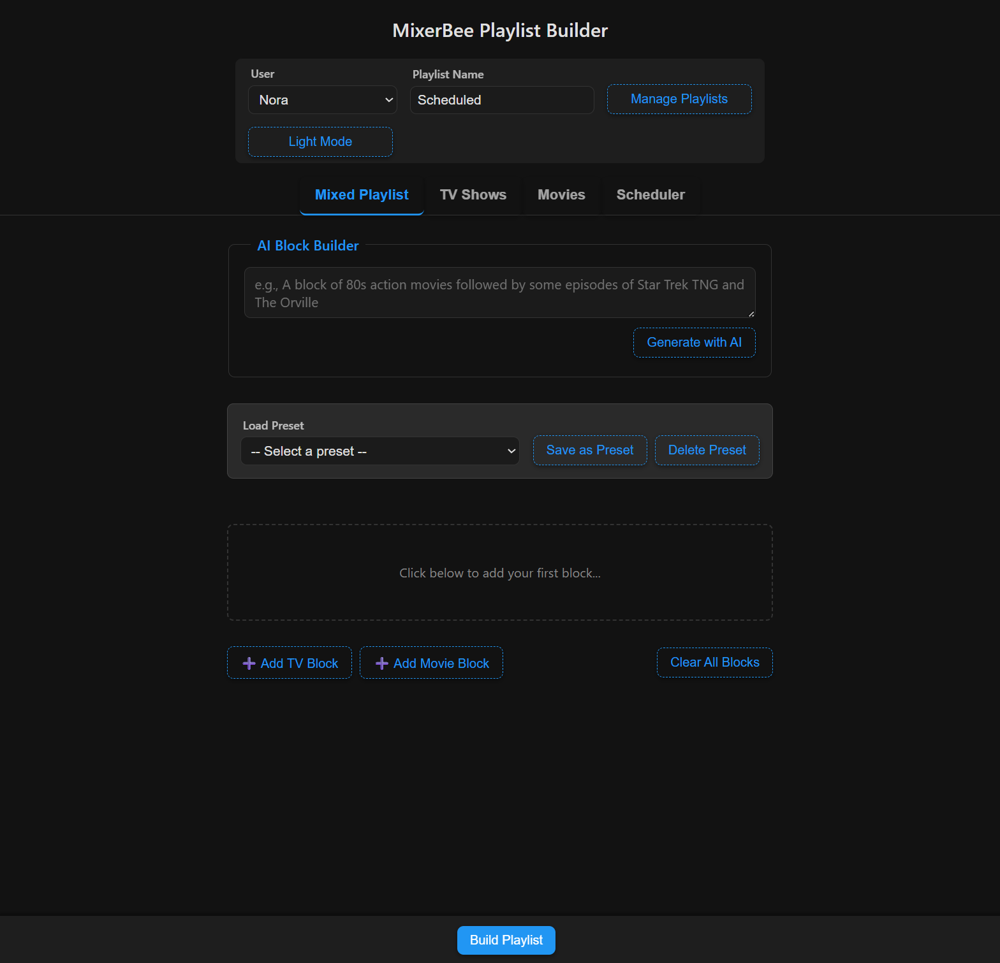
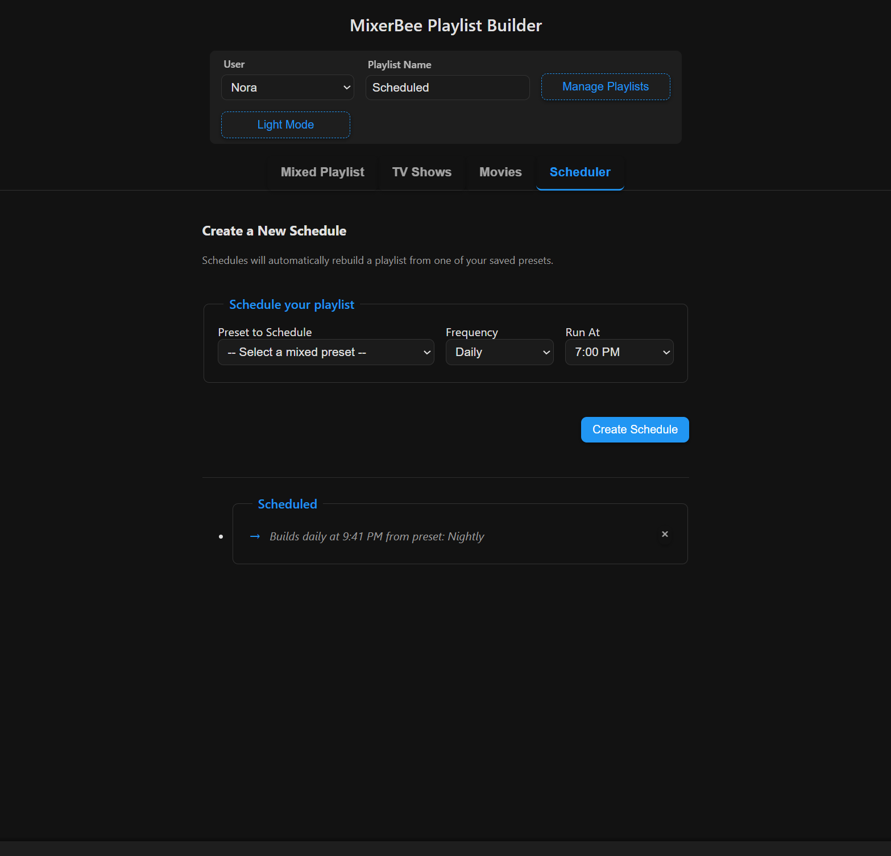
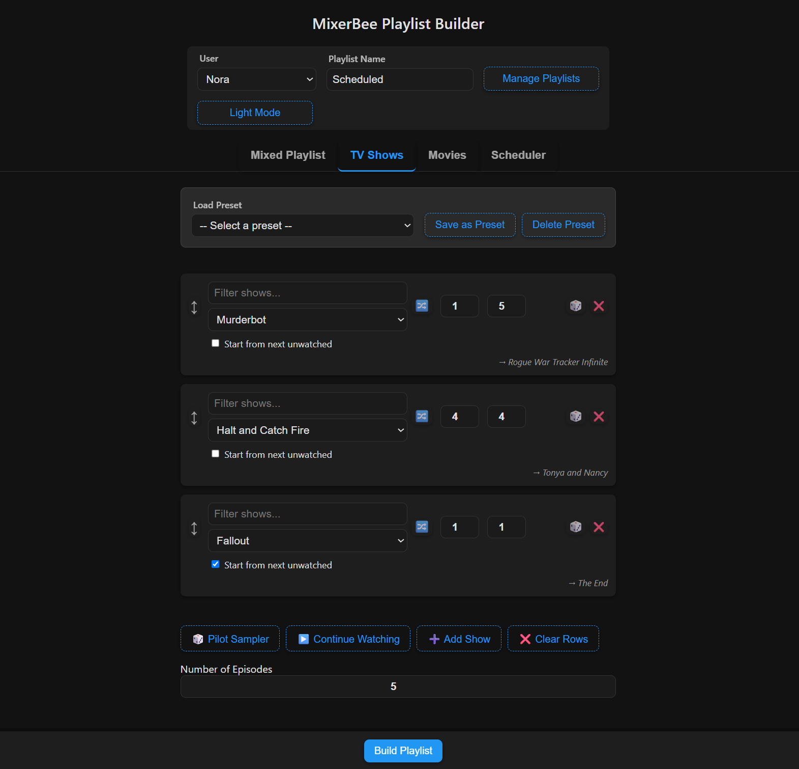
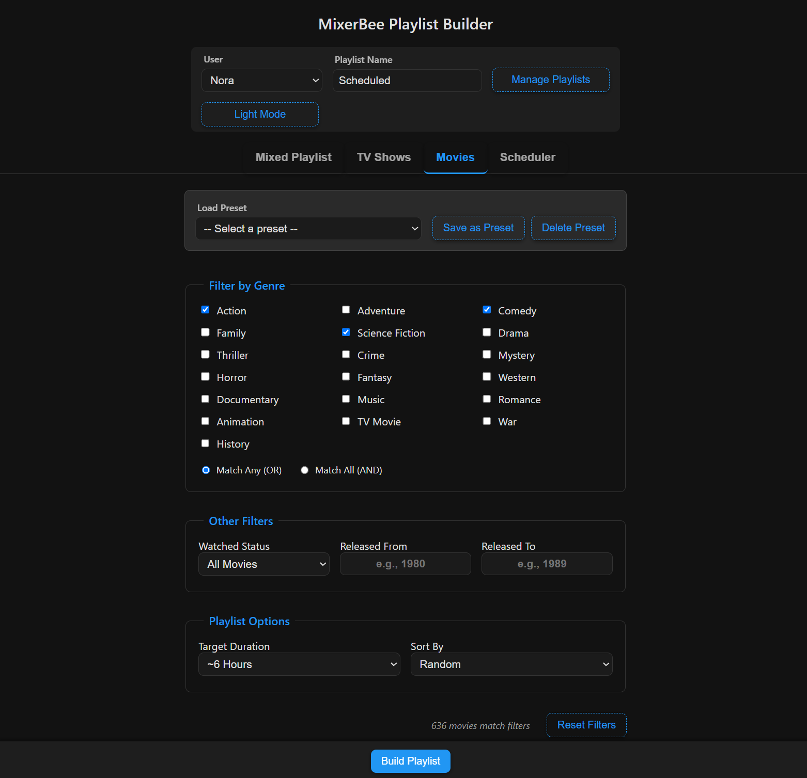

# MixerBee 🐝

**MixerBee** is a self-hosted web app for building “smart-ish” playlists on your [Emby](https://emby.media/) server. Mix episodes from multiple shows, auto-pick movies that fit your criteria, or schedule block-style programming to mimic a TV channel.

## ✨ Features

* **AI Block Builder** (Optional): Use natural language to build complex playlists. Simply ask for what you want (e.g., "80s action movies and some episodes of Star Trek"), and let the AI generate the playlist blocks for you. *Requires a Google Gemini API key.*
* **TV Shows**: Interleave episodes from multiple series, starting at any season/episode or automatically from the first unwatched episode.
* **Movies**: Generate movie playlists by genre, year range, watched status, and more.
* **Mixed Playlists**: Chain TV and movie blocks to create a channel-like schedule. Save and load your complex configurations as presets.
* **Playlist Scheduling**: Automatically rebuild your favorite presets on a daily or weekly schedule. Set your "prime time" or "Saturday morning cartoon" blocks once and always have fresh content ready to watch.
* **Preset Import/Export**: Import and Export presets in Base64 text strings:
* **Quick Playlists**: Instantly create special playlists:
    * **Pilot Sampler**: Automatically finds and interleaves pilot episodes from shows you haven't started.
    * **Continue Watching**: Creates a playlist of the next unwatched episode from your most recently watched shows.
    * **Forgotten Favorites**: Creates a playlist of favorited movie you haven't watched in a while.
* **CLI**: A command line with an interactive wizard for creating simple TV mixes.

## 🖥️ Web Interface

Clean UI, with both Light and Dark modes, makes playlist creation simple and powerful.

*The Mixed Playlist tab, featuring the AI Block Builder.*


*The Scheduler tab for automating your favorite presets.*


*The TV Shows tab for simple mixes and quick playlist creation.*


*The Movies tab for generating playlists based on specific criteria.*


## 🚀 Installation

See **[INSTALL.md](INSTALL.md)** for setup instructions. For container-based setups, see the included `Dockerfile` and `docker-compose.yml`.

To enable the AI Block Builder feature, you must add your `GEMINI_API_KEY` to your `.mixerbee.env` file.

## ⚙️ Usage

### Web Interface

Browse to the server URL (default `http://localhost:9000`) and start building.

* **Mixed Playlist Tab:** The most powerful feature.
    * **AI Block Builder**: Type a request in plain English to get started.
    * **Manual Blocks**: Add TV or Movie "blocks" to build a complex, multi-part playlist.
    * **Presets**: Save your configuration as a preset for easy access later or for use with the scheduler.
* **Scheduler Tab:** Automate your content!
    1.  First, build a playlist you love on the "Mixed Playlist" tab and save it as a preset.
    2.  Go to the "Scheduler" tab.
    3.  Select your saved preset, choose a frequency (Daily or Weekly), pick the days, and set a time.
    4.  Click "Create Schedule". Your playlist will now be automatically rebuilt on Emby at the specified time.

### Command Line

The CLI is best for quickly creating simple, interleaved TV show playlists.

```bash
chmod +x mixerbee    # one-time
# Mix 5 episodes each from The X-Files and Fringe, starting at S01E01
./mixerbee "The X-Files::S01E01" "Fringe::S01E01" --count 5
# Run the interactive wizard
./mixerbee --interactive
# See all options
./mixerbee --help
```
