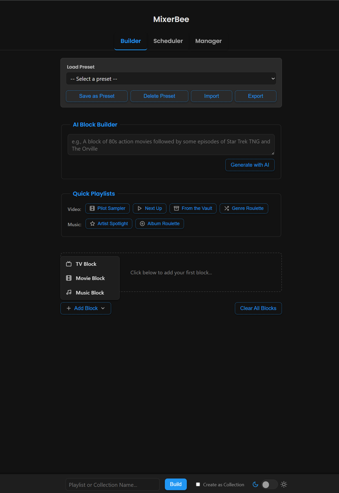
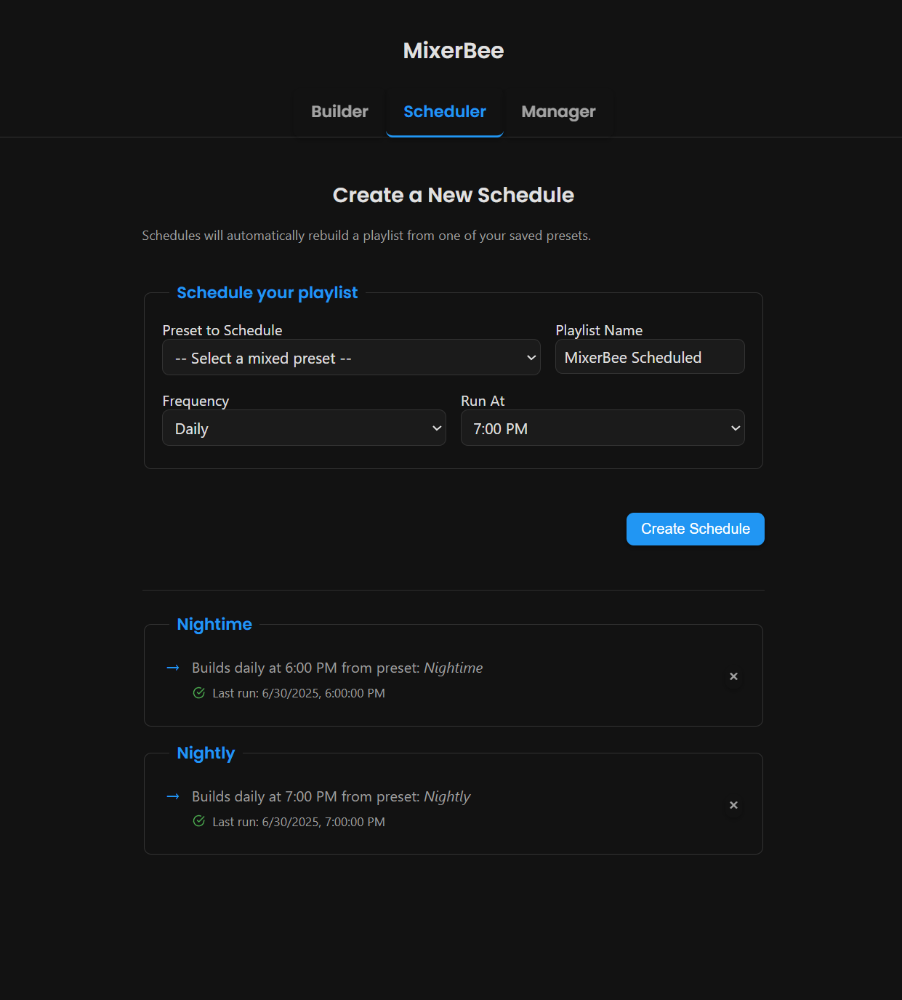
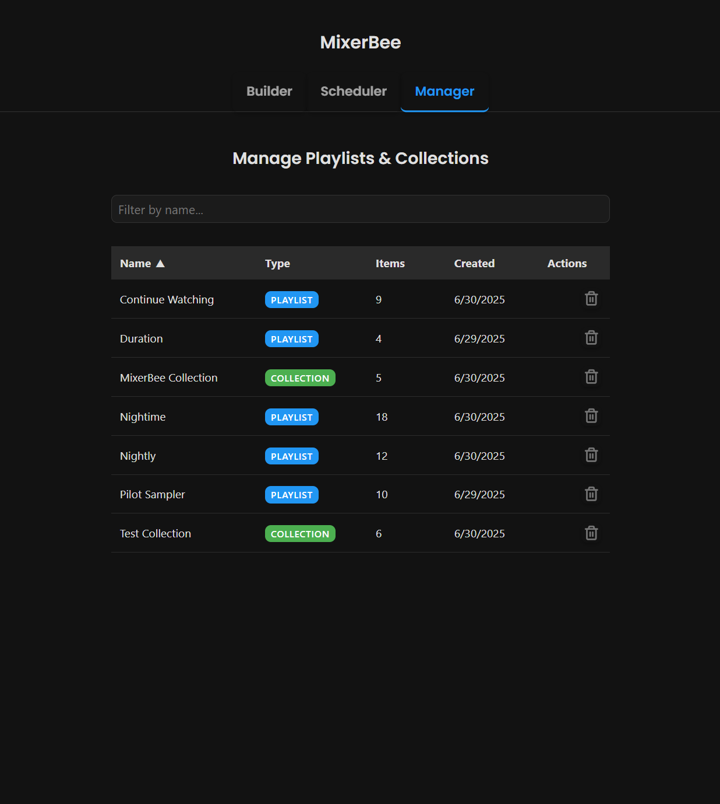

# MixerBee 🐝

**MixerBee** is a self-hosted web app for building and managing smart playlists and collections on your [Emby](https://emby.media/) or [Jellyfin](https://jellyfin.org) server. It started as a basic CLI tool to interleave episodes from multiple shows, and has evolved into a fully-featured web-based scheduler and media playlist manager.

Mix episodes across shows, create themed movie blocks, blend music from your favorite artists, or schedule block-style programming to mimic a custom TV channel.

---

## ✨ Features

* **Advanced Playlist & Collection Builder**:

  * **TV Blocks**: Mix episodes from multiple shows. Start from a specific episode or let MixerBee pick up where you left off.
  * **Movie Blocks**: Filter your movie library by genre, year range, watched status, and more.
  * **Music Blocks**: Add songs by artist/album, top tracks, or genre-based selections.
  * **Create as Collection**: Generate static **Collections** inside your server instead of playlists.

* **AI Block Builder** (Optional):
  Use natural language to build playlists (e.g. *"80s action movies and a few episodes of Star Trek"*). Requires a Google Gemini API key.

* **Scheduler**:
  Automate playlist or collection builds daily or weekly. Includes "Last Run" status to confirm success.

* **Manager**:
  View, sort, and delete all playlists/collections from a single dashboard.

* **Auto Playlists**:

  * **Video**: Pilot Sampler, Next Up, From the Vault, Movie Genre Roulette
  * **Music**: Artist Spotlight, Album Roulette, Genre Sampler

* **Modern UI**:
  Responsive dark/light mode interface with collapsible sections.

* **Preset System**:
  Save and reuse block configurations. Shareable via export/import text codes.

---

## 💻 Web Interface

| Builder                                          | Scheduler                                            | Manager                                          |
| ------------------------------------------------ | ---------------------------------------------------- | ------------------------------------------------ |
|  |  |  |

---

## 🚀 Installation

See [INSTALL.md](INSTALL.md) for full setup instructions.

You can run MixerBee via:

* [Docker Hub](https://hub.docker.com/r/trulytilted/mixerbee)
* Manual Docker build
* Custom Python environment

To enable AI features, add your `GEMINI_API_KEY` to your `.env` file.

---

## ⚙️ Usage

After install, open [http://localhost:9000](http://localhost:9000) and start building.

### Builder Tab

* Add TV, Movie, or Music blocks
* Name and build as Playlist or Collection
* Save as preset for automation later

### Scheduler Tab

* Pick one or more saved presets or Auto Playlists
* Choose frequency (Daily or Weekly)
* Set the time and days
* Let MixerBee rebuild the content on schedule automatically

### Manager Tab

* View all your playlists and collections
* Search, sort, and delete items

---

## ⚠️ Known Issues

<strong>Initial environment setup via UI may require restart</strong>

 

If the `.env` file is first created through the Web UI, you must restart the container or app for it to take effect. Until restarted, the app may behave unexpectedly.

*\[#todo: improve live reload of environment config]*

---

Enjoy!
