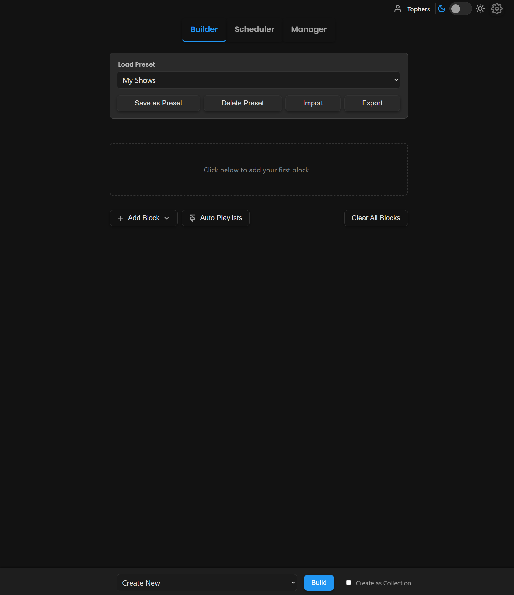
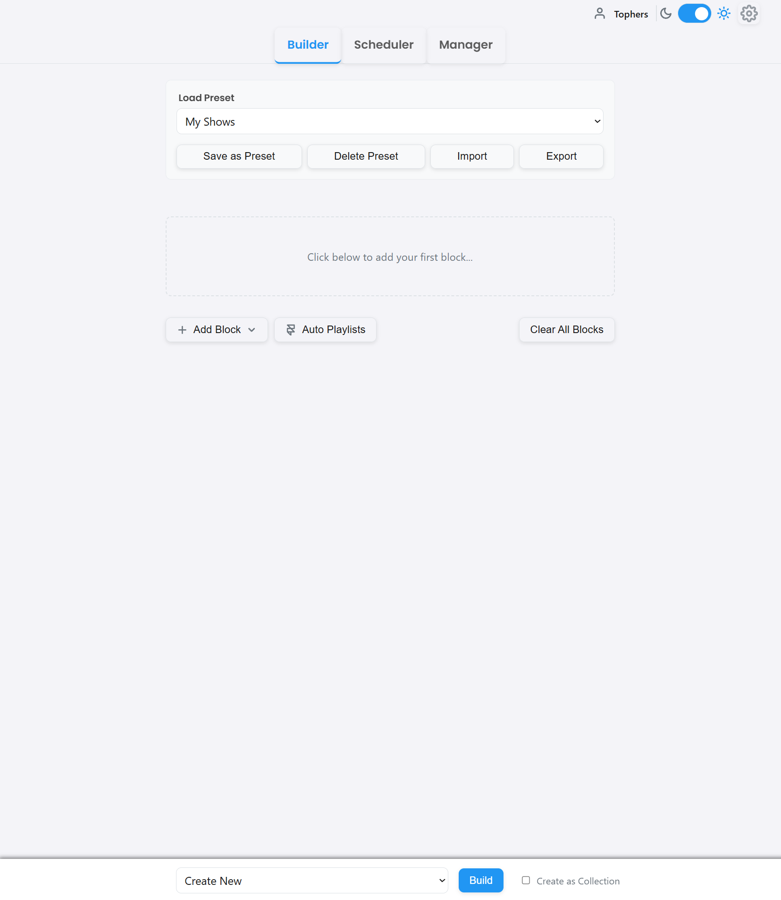
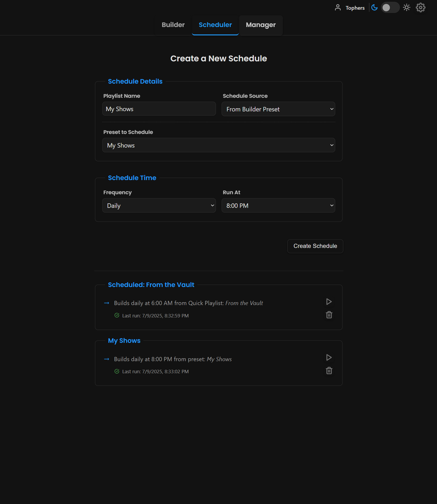
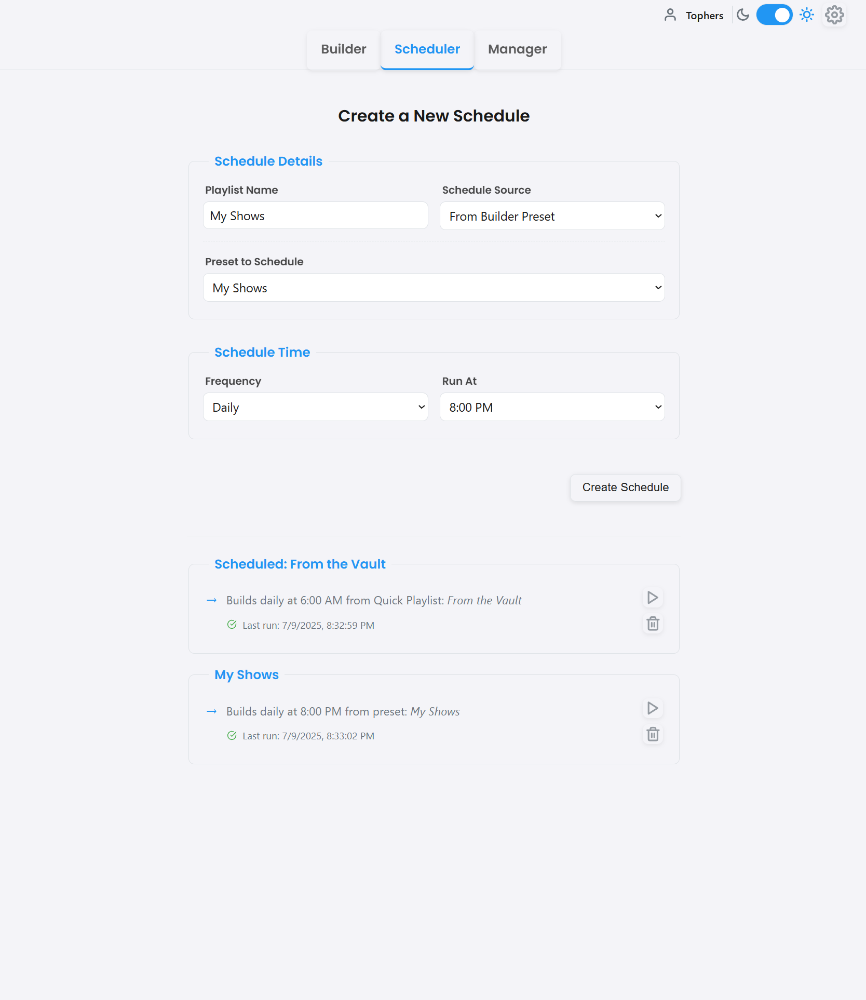
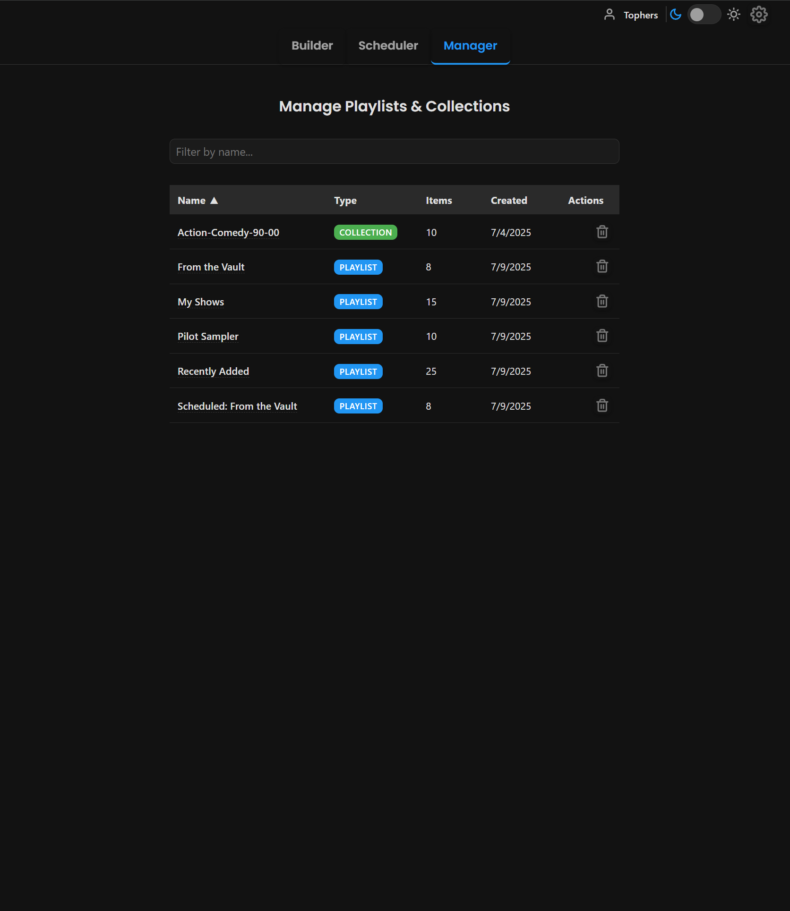
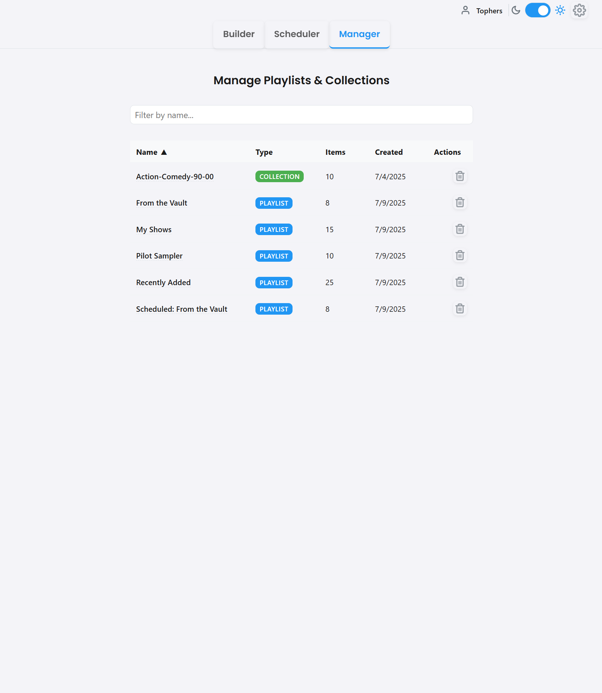

# MixerBee 🐝

**MixerBee** is a self-hosted web app for building and managing smart playlists and collections on your [Emby](https://emby.media/) or [Jellyfin](https://jellyfin.org) server. 

MixerBee allows you to interleave episodes across multiple shows, create themed movie blocks with complex filters, and automate your media management with a robust scheduling engine. Whether you want to mimic the feel of a custom TV channel or keep a "Next Up" playlist perfectly synced across devices, MixerBee is built to handle it.

---

## Features

* **Advanced Playlist & Collection Builder**:
  * **TV Blocks**: Interleave episodes from multiple shows. Start from a specific point or automatically pick up from the next unwatched episode.
  * **Movie Blocks**: Filter by genre, year range, studio, cast, and watched status.
  * **Music Blocks**: Blend tracks by artist, album, popularity, or genre.
  * **Static Collections**: Optionally generate native server **Collections** (BoxSets) instead of playlists.

* **Live Synchronization (Webhooks)**:
  MixerBee can listen for server events. Mark a show as watched or add new media, and MixerBee will automatically trigger a debounced rebuild of your relevant playlists within seconds.

* **Hardened Stability**:
  Engineered for long-term uptime with a "self-healing" auth system, database connection pooling, and transaction-safe playlist rollbacks to prevent data loss during network blips.

* **AI Block Builder** (Optional):
  Use natural language prompts to build complex mixes (e.g. *"A block of 90s thriller movies followed by two random episodes of The X-Files"*). Requires a Google Gemini API key.
  
* **Scheduler**:
  Automate your builds on a daily or weekly cadence with a full "Last Run" log for every job.

* **Manager**:
  A unified dashboard to view, sort, search, and delete all playlists and collections on your server.

---

## Web Interface

| Builder (Dark)                                         | Builder (Light)                                          |
| ------------------------------------------------------ | -------------------------------------------------------- |
|  |  |

| Scheduler (Dark)                                           | Scheduler (Light)                                            |
| ---------------------------------------------------------- | ------------------------------------------------------------ |
|  |  |

| Manager (Dark)                                         | Manager (Light)                                          |
| ------------------------------------------------------ | -------------------------------------------------------- |
|  |  |

---

## Installation

See [INSTALL.md](INSTALL.md) for full setup instructions.

### Requirements
* **Docker**: Recommended for most users.
* **Python**: v3.14.3+ (if running on bare metal).
* **Media Server**: Emby or Jellyfin with administrative access.

### Quick Start
MixerBee is available via:
* [Docker Hub](https://hub.docker.com/r/trulytilted/mixerbee)
* Manual Docker Build (`docker-compose up --build`)
* Local Python Venv

---

## Usage

### 1. Configure Webhooks (Optional but Recommended)
To enable real-time playlist updates, add MixerBee's webhook URL to your Emby/Jellyfin Webhook plugin:
`http://your-ip:9000/api/webhook`

### 2. Build Your Mix
Use the **Builder Tab** to stack TV, Movie, or Music blocks. You can save these configurations as **Presets** for easy reuse.

### 3. Automate
In the **Scheduler Tab**, link your Presets to a time and frequency. MixerBee will ensure your playlists stay fresh without you ever having to open the app again.

### 4. Manage
Use the **Manager Tab** to clean up old playlists or view the contents of your collections without leaving the MixerBee interface.

---

Enjoy!
