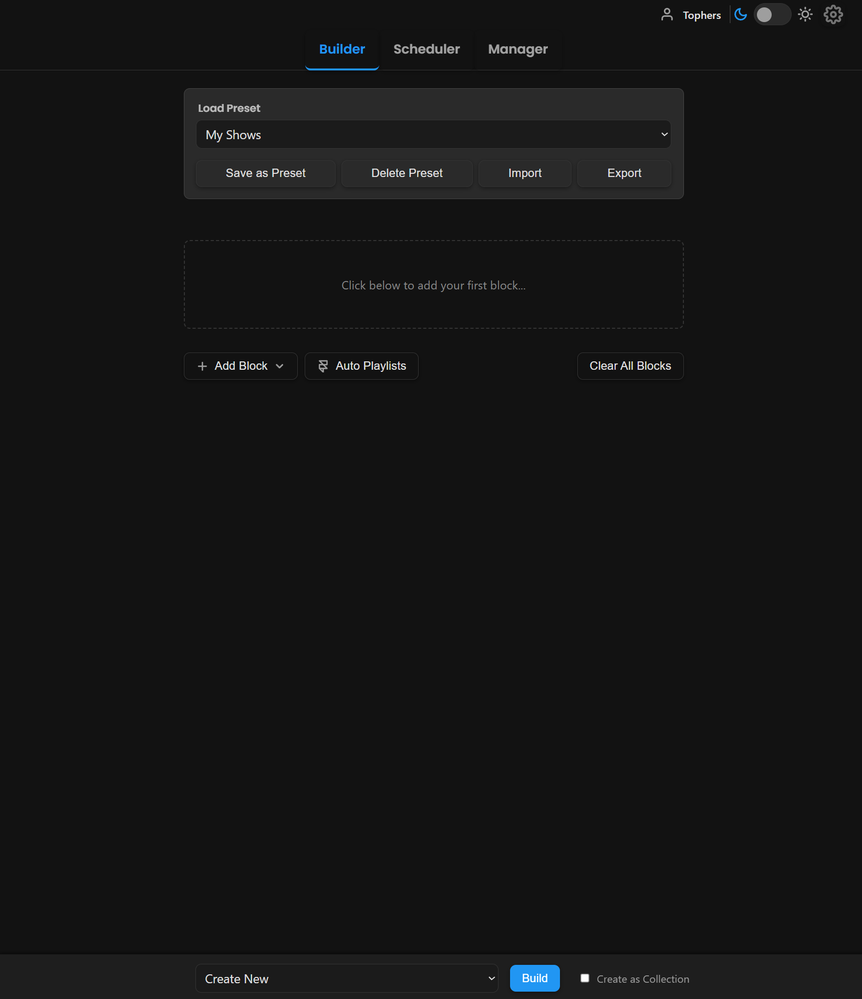
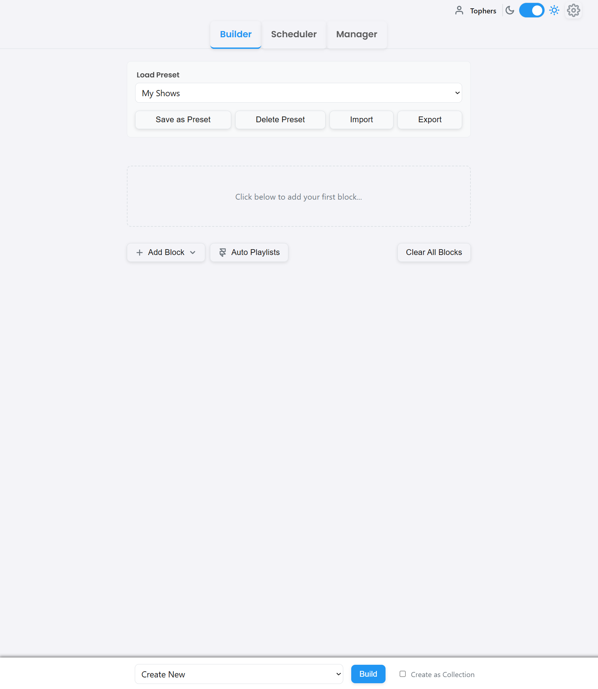
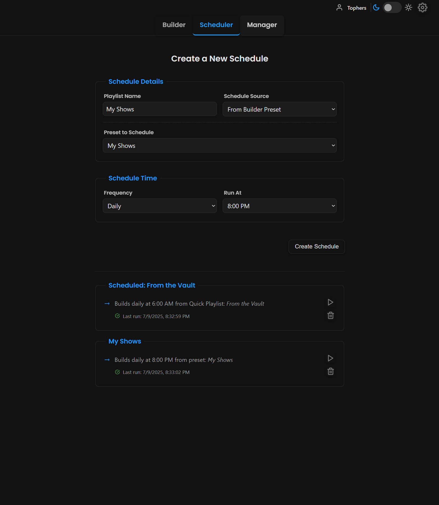
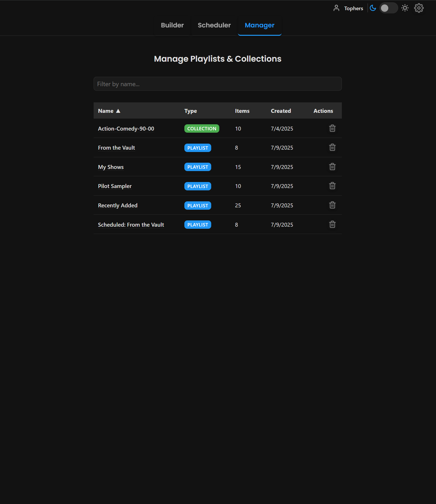

# MixerBee

MixerBee is a self-hosted automation app for [Emby](https://emby.media/) and [Jellyfin](https://jellyfin.org). It lets you create playlists and collections from your media library using metadata filters, optional AI tools, and schedules.

AI features are optional and stay disabled unless you configure them.

MixerBee can be used to:
- build mixed TV, movie, and music lists
- create playlists or collections
- save builds as presets
- schedule builds to run automatically
- rebuild lists when library activity changes

---

## Features

### Builder
MixerBee uses blocks to build media lists.

- **TV Blocks**: Combine episodes from multiple shows. You can start from specific episodes or continue from next unwatched episodes.
- **Movie Blocks**: Filter movies by genre, year, studio, cast, and watched status.
- **Music Blocks**: Build lists from artists, albums, top tracks, or genre-based selections.
- **Collections and Playlists**: Save output as a server playlist or as a collection/box set.

### AI Builder
MixerBee supports both local Ollama and Google Gemini models.

- Use either local AI (preferred) or cloud AI in Settings
- Use prompt-based search to build lists from themes, moods, or styles
- Use AI in two ways:
  1. **Rule-Based**: AI fills in filters and settings for you
  2. **Curated Blocks**: AI selects specific media items from your library based on semantic matches

### Automation
- **Scheduler**: Save builds as presets and run them on a schedule
- **Webhooks**: Rebuild lists automatically when watched status or other server events change
- **Delta Indexing**: Only new or removed items are reprocessed for the local vector database

### Management
- **Manager Dashboard**: View, sort, search, and delete playlists or collections
- **Conversion Tools**: Convert playlists to collections, or collections to playlists
- **Notification History**: Review notifications from the current browser session
- **Verbose Logging**: Optional detailed logging through the `.env` file

---

## Web Interface

(Screenshots may not match the current UI.)

| Builder (Dark) | Builder (Light) |
| :--- | :--- |
|  |  |

| Scheduler | Manager |
| :--- | :--- |
|  |  |

---

## Installation and Setup

### Requirements
- **Docker Hub image** recommended for deployment
- **Python** 3.12+ for bare-metal installs
- **Emby or Jellyfin** account; a server admin account is only needed for server-wide operations such as collections

The project's Docker image, test instance, and production instance run Python 3.14.3. Python 3.12+ is supported for custom installs.

### Quick Start
The recommended installation uses the prebuilt Docker Hub image; no source checkout or local build is needed.

1. Start the container from the directory where you want to keep MixerBee's data:

   ```sh
   docker run -d \
     --name mixerbee \
     -p 9000:9000 \
     -v "$(pwd)/mixerbee_config:/config" \
     --restart unless-stopped \
     trulytilted/mixerbee:latest
   ```

2. Open the UI at `http://your-ip:9000`
3. On first launch, create the local MixerBee owner account directly in the browser
4. Add an Emby or Jellyfin connection for that account, then configure an AI provider if you want AI features

Docker downloads the image if it is not already present. The `mixerbee_config` directory persists settings, presets, schedules, and the local vector database across container replacements.

See [Installation](INSTALL.md) for updates and alternative installs, and [Usage and behavior](USAGE.md) for build behavior, schedules, and backups.

---

## Mood-Based Search

MixerBee can use a local ChromaDB database to match descriptive prompts against your library metadata.

### How it works
1. The app checks your prompt for themes, moods, or descriptive terms
2. It searches your local vector database for matching media
3. It builds results using your library metadata and media IDs

Library metadata used for embeddings is stored locally. If you use a local Ollama model, requests also stay local.

---

## Notes
- More detailed prompts usually produce better results
- You can combine filters and prompt-based requests
- Each local MixerBee account has its own connections, presets, schedules, webhook URL, and AI settings
- Household members can request webhook setup from the installation owner; MixerBee verifies the connection after the first valid media-server event
- Schedules keep running for their saved connection when the user is signed out
- Settings changed in the UI are stored in the database and apply without restarting MixerBee

# Overview & Configuration

---

## Settings & Configuration

MixerBee requires a connection to your Emby/Jellyfin server and optionally an AI provider to provide additional functionality.

*   **Local Accounts:** The first local account is the installation owner and can create household accounts. Each account starts with an independent workspace.
*   **Server Connection:** Supports **Emby** or **Jellyfin**. Requires the server URL, username, and password. 
*   **Connection Switching:** An account can save multiple media connections and switch between their presets, schedules, and library data from the header.
*   **Connection Removal:** Removing a connection clears its MixerBee credentials, presets, schedules, and AI index while leaving media-server playlists and collections untouched.
*   **Media Permissions:** Collection editing controls follow the selected Emby or Jellyfin user's administrator capability. Normal users can still copy a visible collection into a personal playlist.
*   **AI Provider:** Choose between **Ollama (Local)** or **Google Gemini (Cloud)**.
    *   *Ollama Integration:* Requires Ollama URL (e.g., `http://localhost:11434`) and supports starring favorite models for quick-switching. Prefer/require tool-calling capable models.
*   **Vector Database:** MixerBee uses a local ChromaDB instance (Cosine similarity) to index your library for semantic searching.
*   **Maintenance:** The settings panel includes options to reset and re-index the local Chroma database if searches become inaccurate, with the ability to preserve existing metadata enrichments.

---

## Block Types

The Builder uses modular "blocks" to compile mixed playlists. You can combine these blocks sequentially or interleave them.

### Curated Block (Manual)
A hybrid, hand-picked block.
*   **How it works:** Search for specific movies to add, and create dynamic rules for TV shows (e.g., "Next Unwatched", "Specific Season", or "Manual Episode"). 
*   **Best for:** Franchise marathons (e.g., watching a specific Star Wars movie followed by specific episodes of The Mandalorian).
*   **Playback:** You can dictate if movies play first, TV plays first, or if they interleave. Also have snapshot drag/drop ordering for manual movie/show ordering

### Movie Block
A dynamic, rule-based movie compiler.
*   **How it works:** Set filters for genres, release years, specific actors/directors, studios, and watched status. You can cap the block by item count or time duration.

### TV Block
A dynamic television compiler.
*   **How it works:** Select one or more series. Set the block to pull the "Next Unwatched" episodes automatically, or define a manual starting point. 
*   **Playback:** Supports interleaving (playing Episode 1 of Show A, then Episode 1 of Show B) or sequential playback.

### Music Block
Music queue generator.
*   **How it works:** Supports multiple modes: specific Albums, an Artist's Top Tracks, random Artist tracks, or broad Genre filters.

### Echo Block (Mirror)
A semantic similarity search using your locally indexed library. "Mirror" is the internal block name; the UI calls it Echo.

*   **How it works:** Choose positive seed movies or shows (e.g., *Blade Runner*) to find titles with similar metadata and mood. Negative seeds steer results away from unwanted similarities; they are not strict exclusion rules. Results are sampled from the matching pool and can vary between builds.
*   **Settings:** Adjust *Exploration Depth* (Strict vs. Discovery), allow both movies and shows with *Mixed Echo*, or include the seed items in the output.
*   **TV results:** A matched show contributes its next unwatched episode, falling back to its first available episode if none is unwatched.
*   **Snapshots:** Save a preview as a snapshot to retain its selected items and order. Echo searches for similar media; it does not copy another block's selection.

### AI Vibe Block (Managed by AI)
Generated exclusively via the AI text-prompt builder.
*   **How it works:** You type a prompt (e.g., "Gritty 90s cyberpunk thrillers"), and the AI queries the vector database, filters the results, and compiles a locked block of highly relevant items.

---

## The AI Architect & Metadata Enrichment

MixerBee can leverage AI for building playlists and semantic understanding of media.

*   **Prompt-to-Playlist:** The AI Builder takes natural language, breaks it down into search concepts, queries your library, and generates the necessary blocks automatically.
*   **Advanced Tweaks:** You can inject a custom system prompt, adjust the AI's creativity (Temperature), force it to verify standard genres, or trust the vector "vibes" exclusively.
*   **Metadata Enrichment:** MixerBee scans your library's titles and overviews, asking the AI to generate 5-12 highly specific "vibe tags" (e.g., *neo-noir, melancholic, fast-paced*). These tags are embedded into the Vector DB, allowing for hyper-specific semantic searches.

---

## Scheduler & Automation

MixerBee can run tasks automatically in the background using cron-style scheduling.

*   **Scheduled Mixes:** Save any block configuration as a "Preset". The scheduler can run that preset daily, weekly, or on a specific interval, compiling a fresh playlist based on your latest watch history and library additions.
*   **Auto Playlists:** Easily schedule maintenance playlists like "Recently Added", "Next Up", "Pilot Sampler", or "Forgotten Favorites".
*   **Enrichment Queue:** Schedule the AI to process a batch of un-enriched media (e.g., 50 items a day) to slowly build your semantic database without hitting rate limits.

---

## Manager

A dedicated interface to manage your resulting media.

*   **View & Edit:** See all generated Playlists and Collections. You can view their contents, re-order items via drag-and-drop, or delete specific items.
*   **Conversions:** Quickly convert a standard Playlist into a BoxSet/Collection directly from the UI.
*   **Library IQ:** Displays a running percentage of how much of your library has been successfully enriched with AI mood tags.
