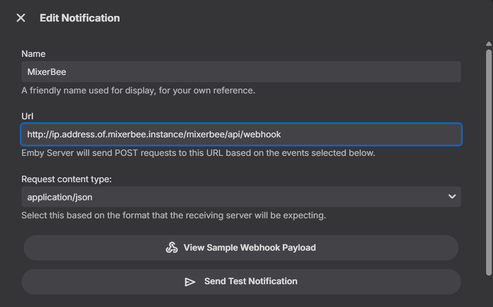
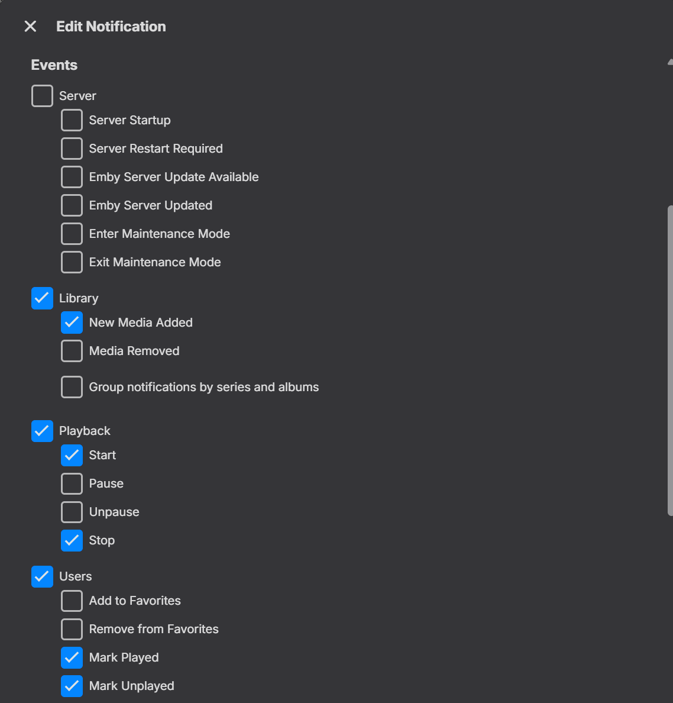

# Webhook Configuration (Emby)

To enable **Live Synchronization**, MixerBee can listen for events from your Emby server. When configured, MixerBee will automatically trigger a rebuild of relevant playlists or collections approximately 10 seconds after you finish an episode, mark a movie as watched, or add new media to your library.

> **IMPORTANT:** Webhook triggers only apply to items configured in the **Scheduler** tab. MixerBee uses the logic defined in your active schedules to perform the refresh. "One-off" builds created manually in the Builder tab are not affected by webhooks.

> **Note:** This should work on JellyFin as well using the Webhooks plugin -- I don't have an instance to provide screenshots or exact entries but the gist is the same.
> 
---

## Prerequisites

* An Emby Server with administrative access.
* MixerBee must be reachable via the network from your Emby server.

---

## Setup Instructions

### 1. Install the Webhooks Plugin (Requires Emby Premium)
1. Open your Emby dashboard.
2. Navigate to **Advanced** > **Plugins**.
3. Go to the **Catalog** tab.
4. Locate and install the **Webhooks** plugin.
5. Restart your Emby server if prompted.

### 2. Add the Notification
1. Navigate to **User Settings** (the user icon in the top right) > **Settings**.
2. **Note:** Ensure you are configuring this for the user account that matches the one used in MixerBee.
3. Select **Notifications** from the left sidebar.
4. Click the **(+) Add Notification** button.

### 3. Configure the Connection
1. **Name**: Enter `MixerBee`.
2. **URL**: Enter the URL for your MixerBee instance followed by the webhook path:
   `http://<YOUR-IP>:9000/api/webhook`
3. **Content Type**: Select `application/json`.

### 4. Select Relevant Events
Select the following events to ensure MixerBee captures all necessary changes:
* **New Media Added**
* **Playback Start**
* **Playback Stop**
* **Mark Played**
* **Mark Unplayed**

5. Click **Save**.

---

## How it Works

MixerBee uses a **10-second debounce timer** for incoming webhooks. 

If you perform a bulk action (such as marking an entire season as "Played"), Emby will send dozens of webhooks in rapid succession. MixerBee will wait until the "storm" of webhooks stops, then perform a **single** efficient rebuild of all your active **Schedules**. 

You can verify the webhook is working by checking the MixerBee console logs; you should see:
`WEBHOOK: Received relevant event 'PlaybackStop'. Queuing background refresh.`

---

Enjoy! 🐝
