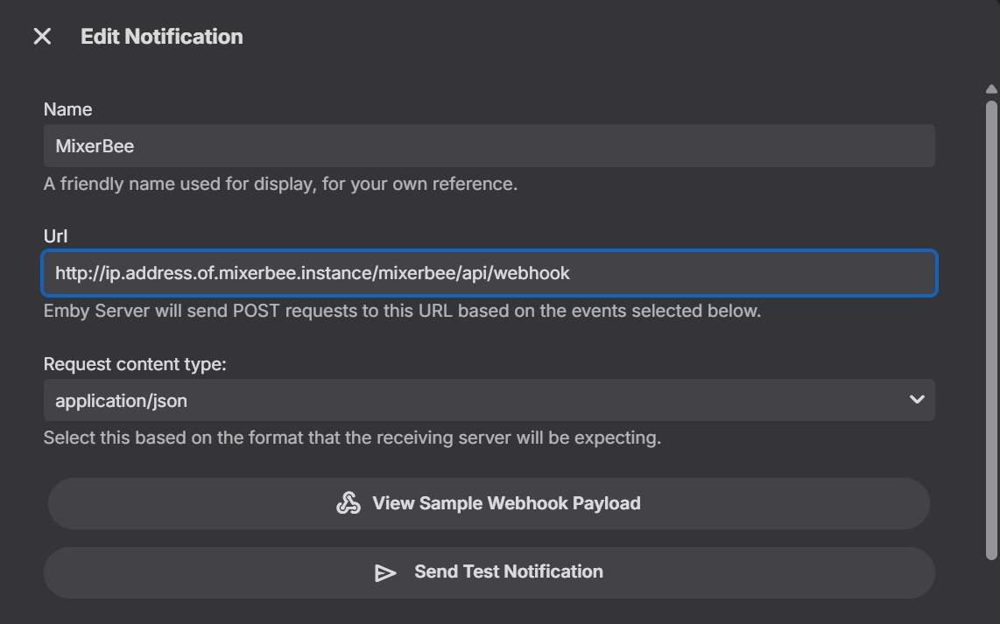
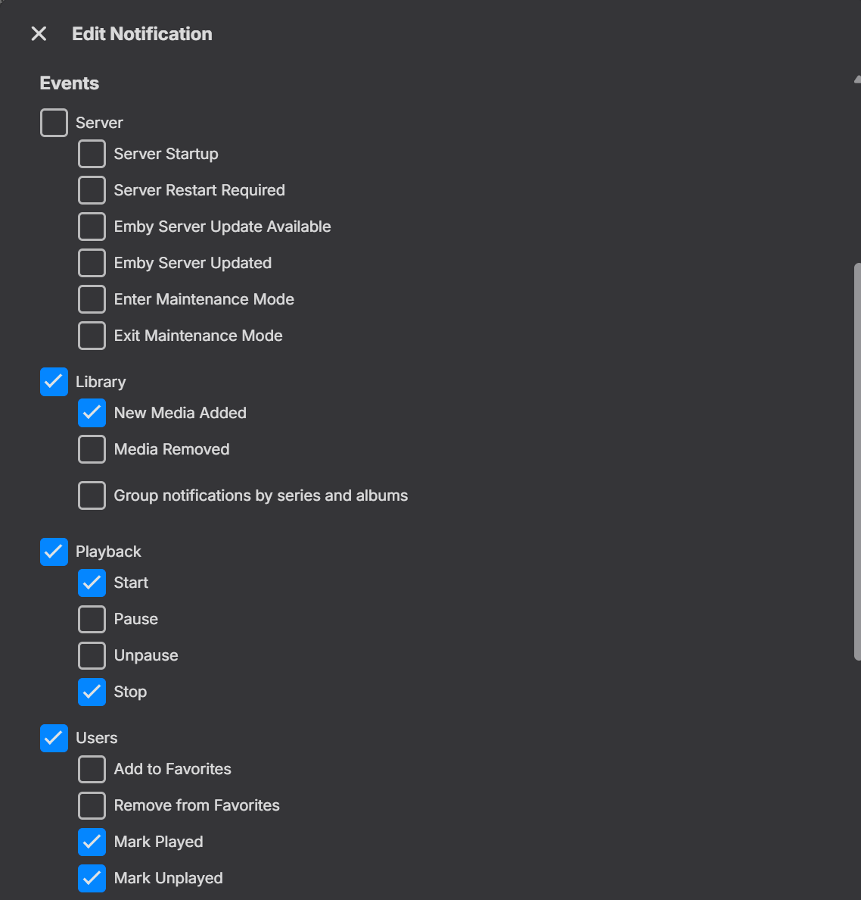

# Webhook Configuration (Emby)

To enable **Live Synchronization**, MixerBee can listen for events from your Emby server. By default, MixerBee queues rebuilds of scheduled playlists or collections 30 seconds after the last relevant webhook for a user. Actual completion depends on queued work and library size.

> **IMPORTANT:** Webhook triggers only apply to items configured in the **Scheduler** tab. MixerBee uses the logic defined in your active schedules to perform the refresh. "One-off" builds created manually in the Builder tab are not affected by webhooks.

> **Note:** This should work on JellyFin as well using the Webhooks plugin -- I don't have an instance to provide screenshots or exact entries but the gist is the same.
> 
---

## Connection-specific URL

Each saved media connection has its own webhook URL and mandatory secret. Open that connection's settings and generate a **Webhook Secret**. The copied URL contains the saved connection ID and its secret. Disabling the secret disables webhook requests for that connection.

Generating a secret prepares MixerBee to receive events; it does not configure the media server. For household members, generating a secret also creates a persistent setup request for the MixerBee installation owner. The owner can copy the URL from **Account settings → Webhook administration**, configure the media server, and mark it installed. MixerBee reports **Connected** only after it receives a valid event using the current secret.

The installation owner should set **MixerBee URL reachable by media servers** in Account settings when the address used by Emby or Jellyfin differs from the browser address—for example, with Docker, a reverse proxy, or split DNS.

The old shared `/api/webhook` endpoint is retired and returns `410 Gone`; it cannot decide which account or server should receive an event.

---

## Prerequisites

* An Emby server administrator who can configure notifications for the selected media user.
* MixerBee must be reachable via the network from your Emby server.

---

## Setup Instructions

### 1. Install the Webhooks Plugin (Requires Emby Premium)
1. Open your Emby dashboard.
2. Navigate to **Advanced** > **Plugins**.
3. Go to the **Catalog** tab.
4. Locate and install the **Webhooks** plugin.
5. Restart your Emby server if prompted.

### 2. Add the Notification
1. Navigate to **User Settings** (the user icon in the top right) > **Settings**.
2. **Note:** Ensure you are configuring this for the media-server user shown in the selected MixerBee connection.
3. Select **Notifications** from the left sidebar.
4. Click the **(+) Add Notification** button.

### 3. Configure the Connection
1. **Name**: Enter `MixerBee`.
2. **URL**: Paste the connection-specific URL copied from MixerBee. It has this form:
   `http://<YOUR-IP>:9000/api/webhook/<CONNECTION-ID>?token=<SECRET>`
3. **Content Type**: Select `application/json`.

### 4. Select Relevant Events
Select the following events to ensure MixerBee captures all necessary changes:
* **New Media Added**
* **Playback Stop**
* **Mark Played**
* **Mark Unplayed**

5. Click **Save**.

---

## How it Works

MixerBee uses a **30-second debounce timer by default**, grouped by user. Each relevant event for that user resets the timer.

If you perform a bulk action (such as marking an entire season as "Played"), Emby may send many webhooks in rapid succession. After the events stop, MixerBee queues all non-enrichment schedules for that user. Events without a user ID queue all non-enrichment schedules. Schedules are not filtered by the event's media type.

Playback-start events do not trigger a rebuild. For an event named `playback.stop`, MixerBee requires `PlaybackInfo.PlayedToCompletion` to be true. This prevents an incomplete playback stop from rebuilding lists. Requests arriving while a schedule is running may queue a follow-up run.

You can verify the webhook is working from the **Connected** status in connection settings or by checking the MixerBee console logs; you should see:
`Event matches triggers! Scheduling debounce rebuild for 30s from now.`

For a Docker Hub install, view logs with `docker logs --tail 100 mixerbee`. An accepted webhook means work was queued; check subsequent job logs for the build result.

---

Enjoy! 🐝
